# SPRING PLUS

## 11. Transaction 심화 - log 테이블 결과
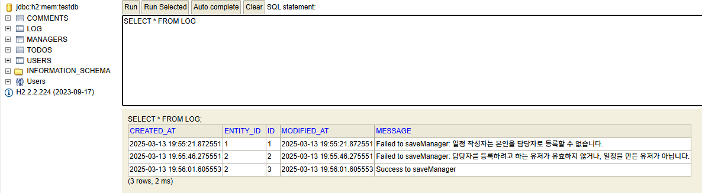
- 매니저 등록 요청을 기록하는 로그 테이블
- 매니저 등록 뿐만 아니라 다른 엔티티에서도 로그 테이블을 사용할 수도 있을 것 같아서 common 패키지에 작성했습니다.
- 매니저 등록을 실패해도 실패 로그가 저장됩니다.

## 12. AWS 활용

  
EC2

#### 탄력적 IP
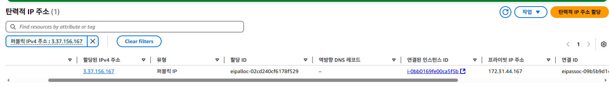

#### Health Check API
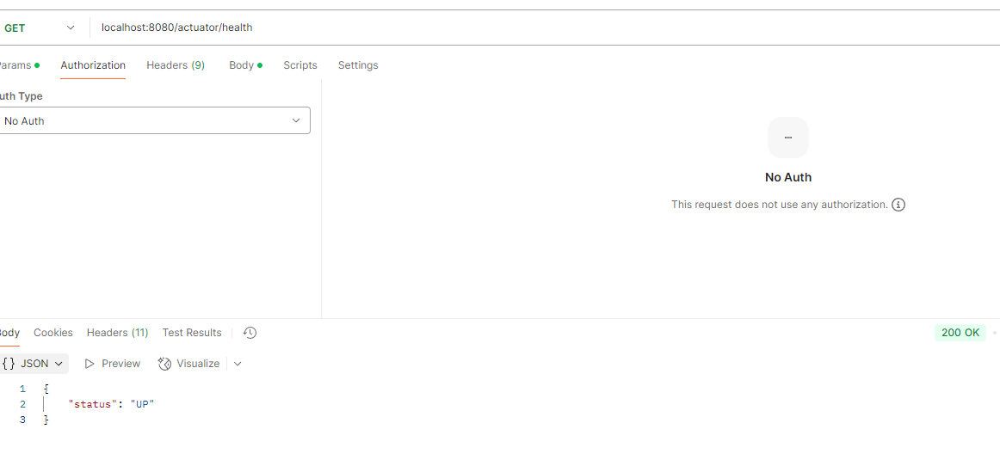

---
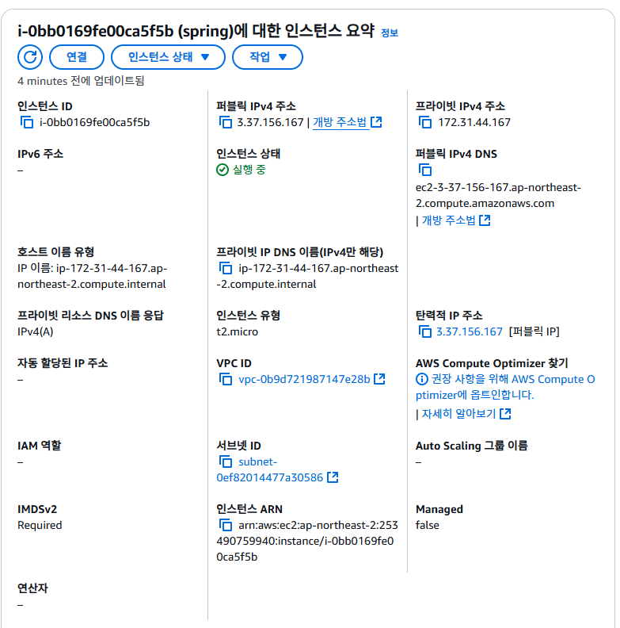

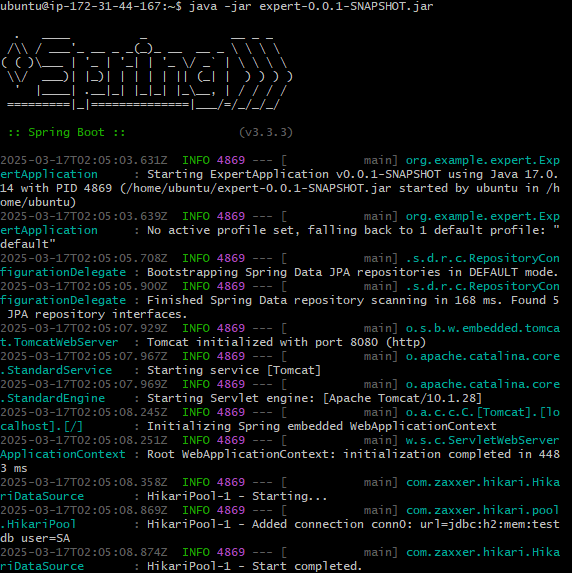
> ssh를 통해 EC2에 접속한 후 jar 파일 실행

 

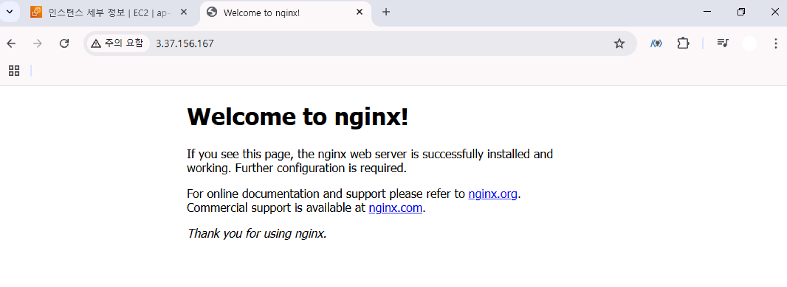
> 지정된 IP 주소로 접속

 

 

  
RDS

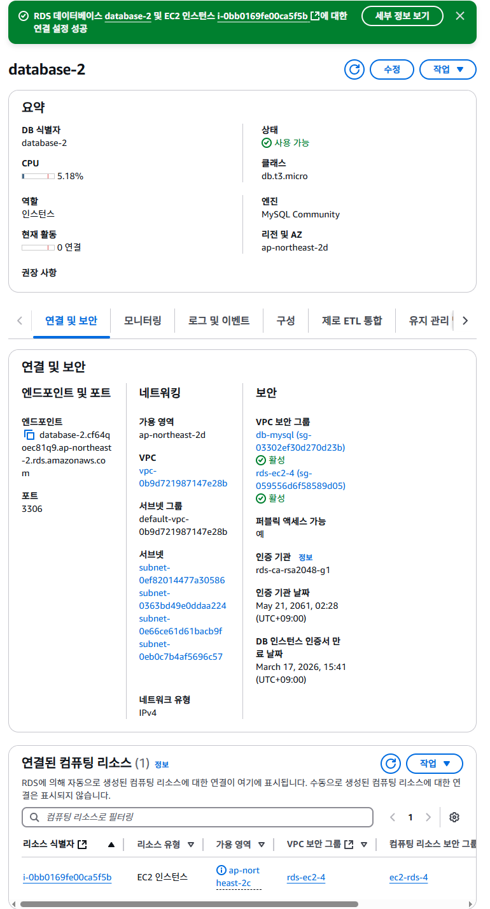

 

  
S3

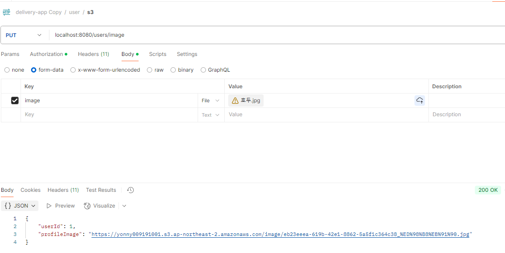  
> 이미지 업로드 API 정상 실행

 

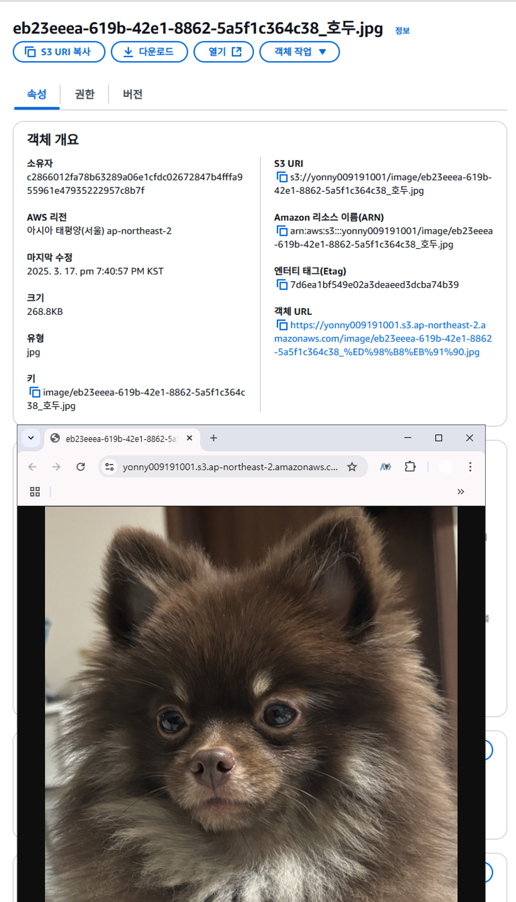  
> S3 버킷에 저장된 이미지 결과(귀엽죠)

 

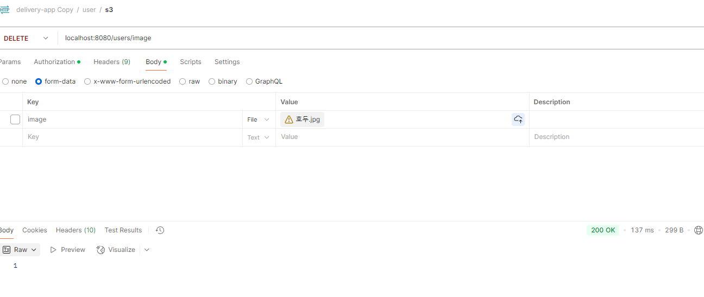
> 이미지 삭제 API 정상 실행 -> S3에서도 삭제됩니다.

 

 

## 13. 대용량 데이터 처리

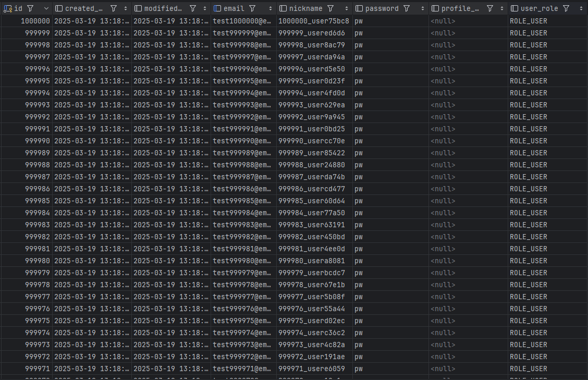
> 유저 데이터 100만 건 생성 결과

 

### 데이터 검색 속도 비교

| **방법**                                     | **시간(ms)** | **개선 비율**    |
|--------------------------------------------|-------------|----------------|
| 1. JPA 쿼리 메서드 사용                     | 540ms       | -              |
| 2. nickname 인덱스 사용                     | 11ms        | 97.96% 개선    |
| 3. nickname 인덱스 + JPQL로 UserResponse 조회 | 8ms         | 98.52% 개선    |

 

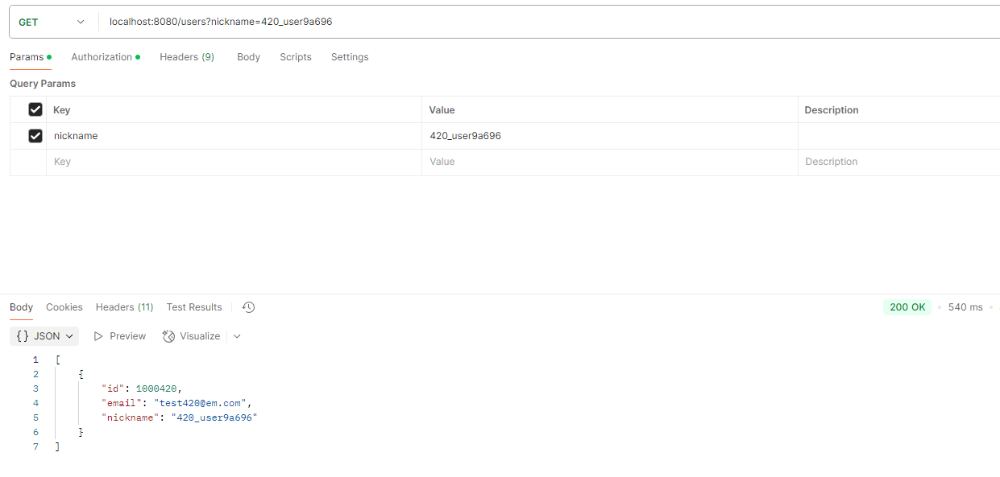
#### 1. jpa 쿼리메서드 사용 -> 540ms

 

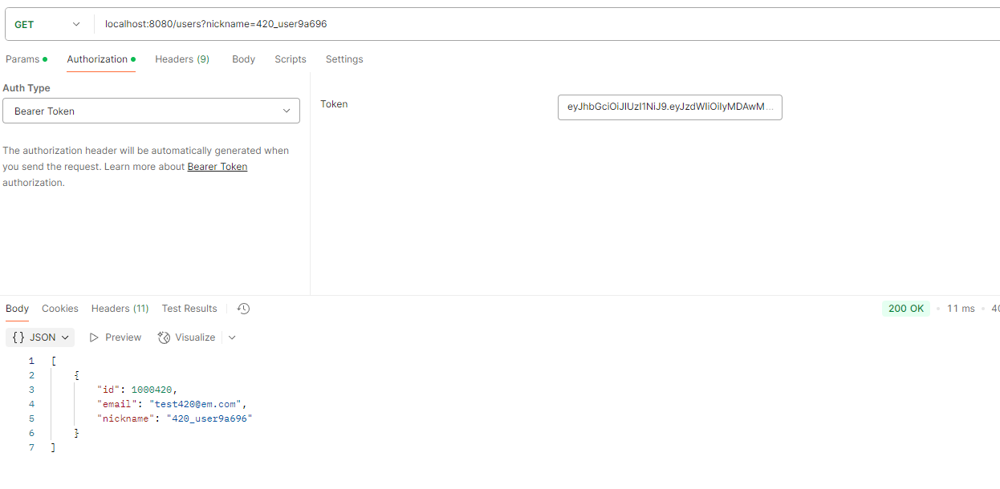
#### 2. nickname 인덱스 사용 -> 11ms  
`CREATE INDEX idx_nickname ON users(nickname);`

 

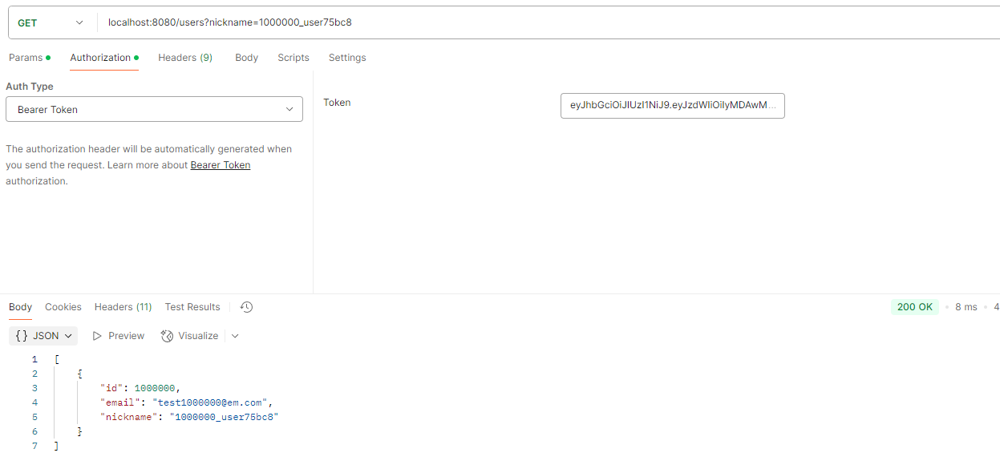
#### 3. nickname 인덱스 사용 + db에서 UserResponse를 바로 조회하는 JPQL 쿼리로 변경 -> 8ms
`@Query("SELECT new org.example.expert.domain.user.dto.response.UserResponse(u.id, u.email, u.nickname)" +`  
`"FROM User u WHERE u.nickname = :nickname")`  
`List<UserResponse> findByNickname(@Param("nickname") String nickname);`
